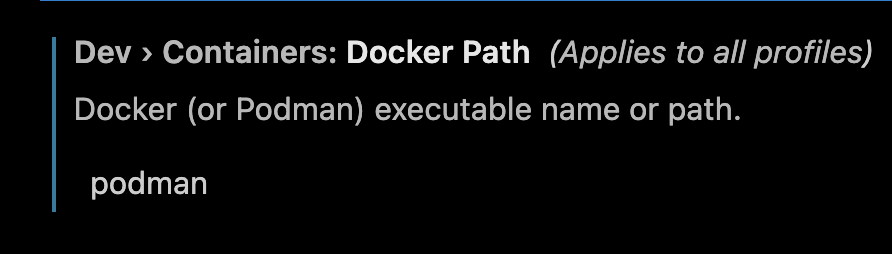

# Offlaid

A Python-based platform for connecting and modernizing agricultural operations through IoT sensors, data analytics, and smart farming capabilities.

### Features

- Real-time sensor monitoring (soil moisture, temperature, humidity, etc.)
- Automated irrigation control
- Crop health analysis and predictions
- Weather data integration
- Mobile app connectivity
- Data visualization dashboard
- Smart alerts and notifications

### Inspiration

Being laid off SUCKS. The financial hit is whatever, but it's really about collaborating, participating, and contributing to the community.

To help us stay sharp, and to show other companies that we're more worth hiring than the competition, I thought it would be fun to build something.

I have a passing interest in restorative agriculture, so I thought it would be interesting to work on a project around that idea.

### Tech Stack

I would choose GoLang, but Uplight was a Python shop. As such, I thought it would be most considerate to build this in Python.

The frontend will use React with Typescript. Untyped programming is for unwashed philistines.

### Architecture

ALL BUSINESS LOGIC LIVES ON THE SERVER. The client is responsible for sending events to the server. The server will process events and send responses back to the client. If we can't use Websockets for some reason,  then the front end will poll the server. Clients are dumb. Keep them that way.

#### Client

The client should encapsulate visual behaviors and user interactions. The client is important in that it reflects the way that end users interact with the system. However, the client should be completely agnostic to the business logic and disposable. This is because of all the components of the stack, the client is the most volatile. Indubitably, if any endeavor is moderately successful, we will need to repackage "client behavior" via a different access method. If we depend on the client to know what that behavior is, we're either fucked or we have a boat load of work to do. Neither one of these makes sense, because it's avoidable. **Keep. Business. Logic. Out. Of. The. Client.**

#### Server

We use n-tier architecture principles. We encapsulate volatility in 4 tiers:

1. **Handlers** - Handlers simply receive requests and marshal the request to a `dataclass` or `namedtuple`.

1. **Managers** - Managers are responsible for coordination. For example, a water scheduling suggestion may require coordination across weather predictions, current soil moisture levels, crop types planted, and maturity. This complexity is _different_ than the complexity of "how do we..." As such, Managers give us a place to consolidate our coordination logic.

1. **Services** - Services are responsible for business logic. For example, a manager may determine that a user should be alerted to the fact that their soil is too wet. It's the service's job to decide what that actually means.

1. **Repositories** - Repositories interact with data storage. We don't want the specifics of the data storage to leak into the other aspects of the application. This is because we want to keep things flexible in the future.

### Tooling and Installation

(The project was built on a Mac with a M1. If you have different steps to get it working, please update this README to reflect your environment.)

This project uses [devcontainers](https://containers.dev/) to provide a consistent development environment. See the configuration for your editor. I (Mickey) am currently using Cursor and Podman. There are some extra steps to get the project running.

1. Install Cursor from [here](https://cursor.sh/).
1. Install the [devcontainer](https://marketplace.visualstudio.com/items?itemName=devcontainers.devcontainers) (Go to the ) extension for Cursor.
1. Open the project in Cursor. Then, open `finder` and drag the downloaded extension into the `extensions` folder in the sidebar.
1. After the extension is installed, open the extension settings and set the docker path to `podman`.
    
1. Run `make install_podman` to install podman.
1. Restart Cursor, then open the command palette and run `Dev Containers: Rebuild & Reopen in Container`.

The dev container will include all of the packages and dependencies needed to work on the client and server.
